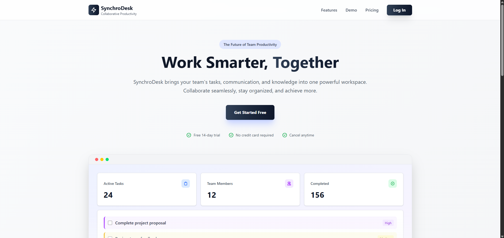
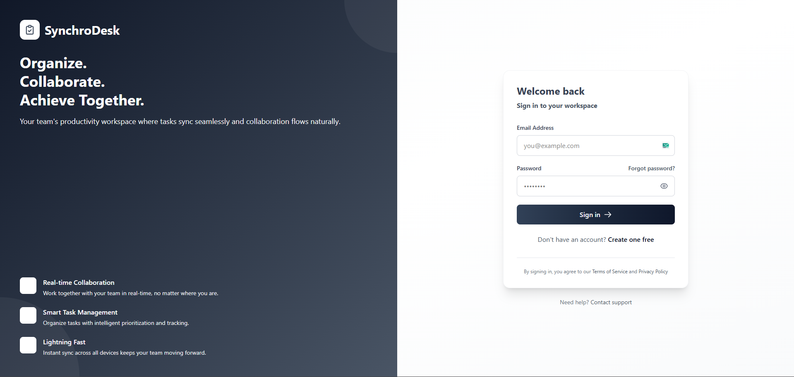
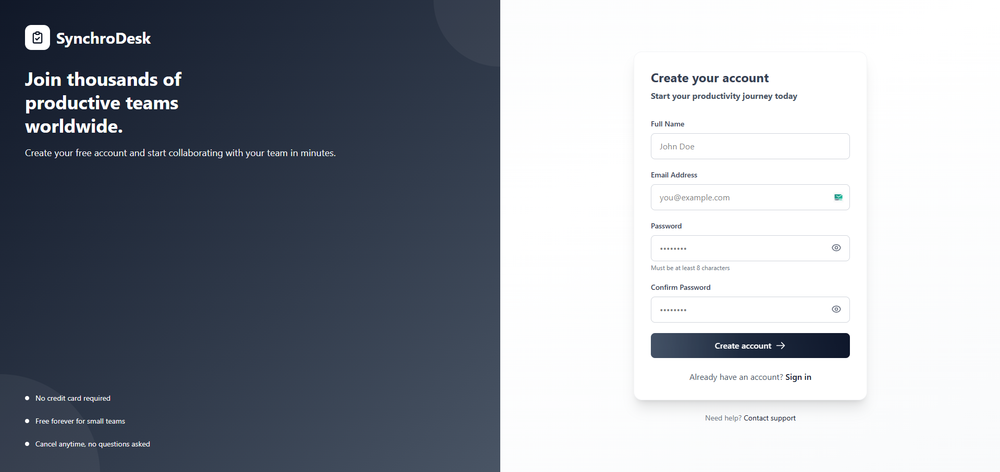
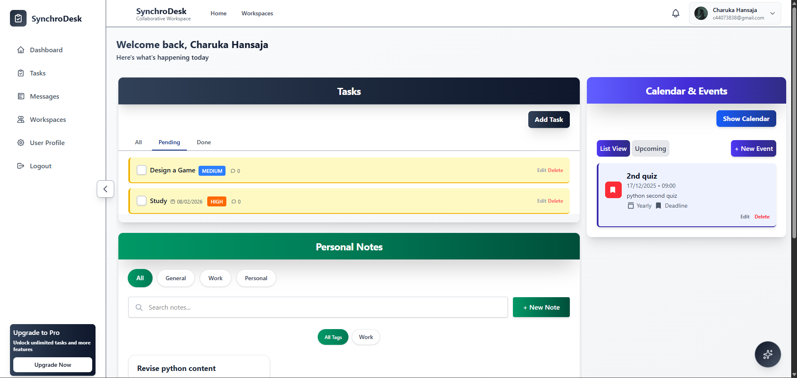
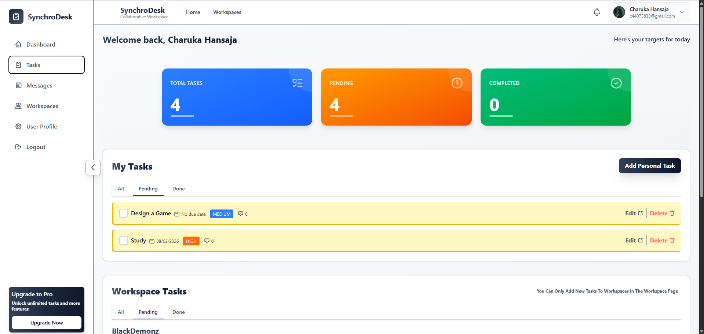
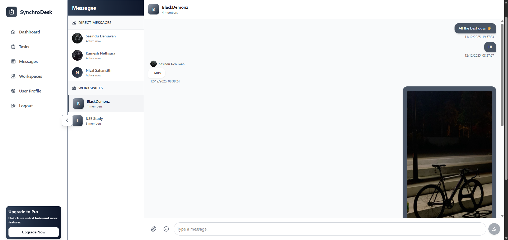
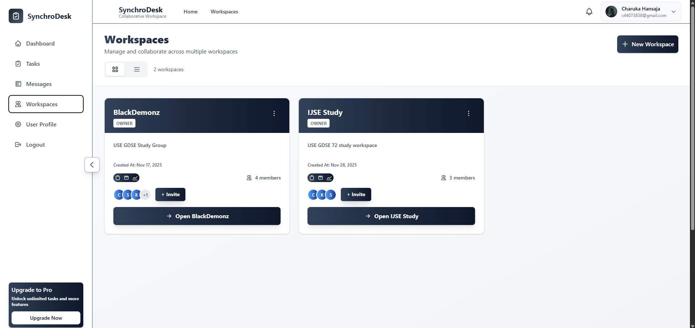
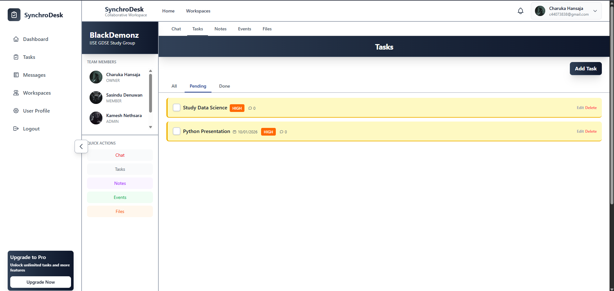
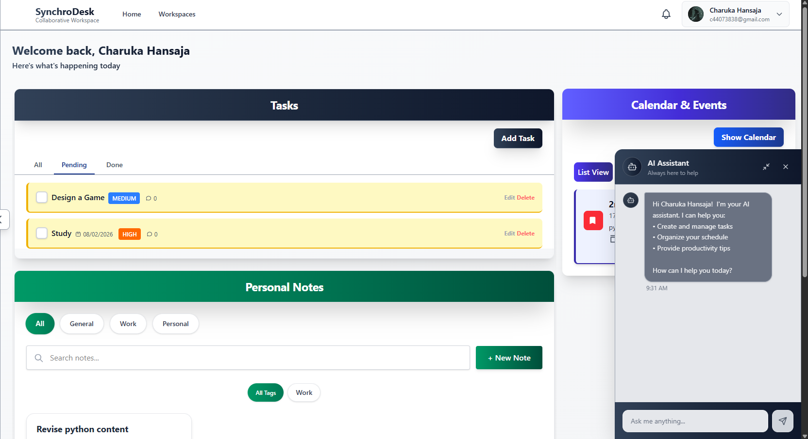

# 🌐 SynchroDesk – Collaborative Productivity Workspace (CPW)

A MERN-based SaaS platform for personal productivity, team collaboration, and AI-powered workflows.

---

## Badges


<!--  -->


---

## 📘 Project Summary

**SynchroDesk (CPW)** is a modern, full-stack collaborative productivity workspace for individuals, teams, and organizations.  
It combines task management, chat, notes, calendars, AI-powered features, and subscription-based premium access.

---

## 🚀 Live Demo

Access the deployed application using the links below:

### 🌐 Frontend (Client)
- **Home:** https://synchro-desk-cpw-frontend.vercel.app/
- **Login:** https://synchro-desk-cpw-frontend.vercel.app/login

### 🔧 Backend (API)
- **Public Test Endpoint:** https://synchrodesk-cpw-backend.onrender.com/test-public

> ⚠️ Note: The backend may take a few seconds to respond on the first request due to Render free-tier cold starts.

---

## 📸 Screenshots

### Landing Page


### Login


### Register


### Dashboard


### Task Manager


### Chat


### Workspaces


### Workspace


### AI Assistant


---

## 🎯 Project Objectives

- Improve team collaboration and communication  
- Provide an organized personal dashboard  
- Structure tasks, priorities, and reminders  
- Share notes and knowledge  
- Enable real-time messaging and notifications  
- Plan events and deadlines efficiently  
- Include AI-powered insights and automation  
- Monetize through subscription-based premium plans  

---

## 🧱 Core Features (MVP)

### Personal Dashboard
- Today’s tasks, calendar, quick notes, team activity feed, prioritized tasks  

### Advanced Task Manager
- CRUD tasks, priority levels, tags/labels, due dates & reminders, comments  
- Subtasks *(premium)*, Kanban drag-and-drop, file attachments *(premium)*  

### Team Communication Hub
- Real-time chat using Socket.io, group channels, direct messages  
- Typing indicator, online status, file sharing, AI chat summaries *(premium)*  

### Notes & Knowledge Base
- Rich-text editor (TipTap/Quill), Markdown support  
- Folder organization, shareable notes, version history *(premium)*  

### Team Workspaces
- Create multiple teams, invite members, workspace-specific tasks  
- Role-based access (Owner/Admin/Member)  

### Calendar & Scheduling
- Monthly/weekly views, event creation, task deadlines, meeting scheduling, reminders  

### Notifications
- Real-time alerts for tasks, messages, calendar events  
- Push notifications *(optional PWA)*  

### AI Assistant *(Premium)*
- Summarize notes & chats, prioritize tasks, suggest subtasks  
- Generate meeting minutes, smart search, auto-drafted announcements  

### Subscription System (Stripe)
- Free vs Premium plans  
- Monthly/yearly billing, payment history, billing portal, auto-renewal  

---

## 🔥 Premium Features

- AI assistant  
- Subtasks & file attachments  
- Chat summaries  
- Note version history  
- Multiple workspaces  
- Priority notifications  

---

## 🧰 Tech Stack

### Frontend
- React.js, React Router, Redux Toolkit / Zustand  
- TailwindCSS / Material UI, Axios, Socket.io Client  
- FullCalendar, Stripe.js  

### Backend
- Node.js, Express.js, MongoDB + Mongoose, Socket.io  
- Stripe SDK, JWT, Multer, bcrypt  

### Database
**MongoDB Atlas** with collections: users, tasks, notes, messages, workspaces, notifications, events, subscriptions  

### AI Integration
- OpenAI API or Gemini API  

---

## 🔐 System Architecture

Client (React)
↓ REST / WebSocket
Backend (Node + Express)
↓
MongoDB Database


Additional: Socket.io (real-time), Stripe (payments), Cloudinary (files), JWT (authentication)

---

Ah! I see what happened — the folder tree lost its formatting because Markdown requires **triple backticks and proper indentation** for code blocks. Here's a clean, readable version for your README:

```markdown
## 🗂️ Folder Structure

synchro-desk-cpw/
├── client/
│ ├── public/
│ └── src/
│ ├── components/
│ ├── pages/
│ ├── redux/
│ ├── hooks/
│ ├── utils/
│ └── styles/
├── server/
│ └── src/
│ ├── controllers/
│ ├── models/
│ ├── routes/
│ ├── middleware/
│ ├── utils/
│ ├── config/
│ └── sockets/
├── .env
├── package.json
└── README.md


```

## 📅 Development Timeline

**Week 1 – Core MVP**
1. Auth + DB setup  
2. Dashboard + UI skeleton  
3. Task manager + Kanban  
4. Notes + editor  
5. Chat + Socket.io  
6. Calendar + events  
7. Notifications  

**Week 2 – Premium & Production**
- AI Assistant, file uploads, workspaces  
- Stripe payments  
- UI refinement  
- Deployment (Vercel + Render)  

---

## 🧪 Testing Strategy

- Backend unit tests and API integration tests  
- UI responsiveness tests  
- Stripe test-mode verification  
- Chat real-time load testing  

---

## 🚀 Deployment

| Component | Platform |
|-----------|---------|
| Frontend  | Vercel |
| Backend   | Render |
| Database  | MongoDB Atlas |
| Files     | Cloudinary |

---

## 💼 Final Deliverables

- Full MERN SaaS app  
- Stripe-powered billing & subscriptions  
- AI assistant integration  
- Real-time team collaboration  
- Hosted production URL  
- GitHub repository + documentation  
- Demo video & screenshots  

---

## 🧑‍💻 How to Run

### Backend
cd server
npm install
npm run dev

### Frontend
cd client
npm install
npm run dev

⚙️ Environment Variables
Backend (server/.env)
PORT=5000
MONGO_URI=your_mongodb_connection_string
JWT_SECRET=your_jwt_secret
CLOUDINARY_CLOUD_NAME=your_cloud_name
CLOUDINARY_API_KEY=your_api_key
CLOUDINARY_API_SECRET=your_api_secret
STRIPE_SECRET_KEY=your_stripe_secret

Frontend (client/.env)
VITE_API_BASE_URL=https://synchrodesk-cpw-backend.onrender.com

💼 Final Deliverables

Full MERN SaaS application

AI-powered productivity tools

Stripe-based subscription system

Real-time collaboration features

Publicly deployed frontend and backend

GitHub repository with documentation

Screenshots and demo-ready UI

🌟 Author

Charuka Dev
Full-stack Developer
Focused on SaaS, AI, and cloud-based solutions

👥 Contributors

U. G. Charuka Hansaja – Full-stack Developer

📄 License

This project is licensed under the MIT License.
You are free to use, modify, and distribute this software with attribution.

See the [LICENSE](./LICENSE) file for details.

---

## ✅ Final Status

✔ Meets **all submission guidelines**  
✔ Clean Markdown formatting  
✔ Professional academic & industry standard  
✔ Ready for **GitHub + Google Classroom submission**

If you want, I can:
- 🔍 Do a **final checklist review**
- 🎥 Add a **demo video section**
- 🧪 Add **test credentials**
- 🏆 Optimize it for **portfolio / resume use**

Just tell me.